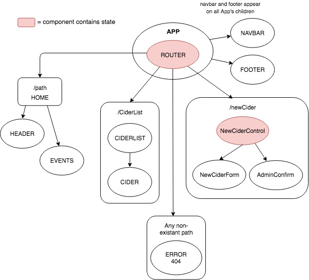

# Cider House
##### Robin Sola // June 29, 2018
---
### Description
 Website of a cider house built using React. Meet the crew, view the taproom list, buy a pint, make edits to existing kegs, and tap a new keg to add to the list.

### Installation
* Clone project folder in terminal: `$ git clone` repository url
* In terminal, run `$ npm install` in project folder home directory
* In terminal, run `$ npm run start` to view in browser

### Brainstorming / Notes
Image of project structure, breaking down content into React components:

Plan:
* Create Router as State and lift Cider List into Router, to allow for inverse data flow from Cider Control.
* Create Add Cider Form component with form for user event to submit a new tapped cider keg to list of Ciders.
* Buy A Pint function component - click button to empty a keg
* Create EventList in Home with Home being a state-full component with EventControl State component and functionality to add new Events to list (similar to Add cider set up - stretch goal!)
* Admin Component - to edit and monitor cider keg list and event list.

### Known Bugs
Work in progress

### Technologies and Resources
* npm / webpack
* REACT
* HTML
* CSS
* JSX / JavaScript

### License
##### Copyright (c) 2018 Robin Sola.
Permission is hereby granted, free of charge, to any person obtaining a copy of this software and associated documentation files (the "Software"), to deal in the Software without restriction, including without limitation the rights to use, copy, modify, merge, publish, distribute, sublicense, and/or sell copies of the Software, and to permit persons to whom the Software is furnished to do so, subject to the following conditions:

The above copyright notice and this permission notice shall be included in all copies or substantial portions of the Software.

THE SOFTWARE IS PROVIDED "AS IS", WITHOUT WARRANTY OF ANY KIND, EXPRESS OR IMPLIED, INCLUDING BUT NOT LIMITED TO THE WARRANTIES OF MERCHANTABILITY, FITNESS FOR A PARTICULAR PURPOSE AND NONINFRINGEMENT. IN NO EVENT SHALL THE AUTHORS OR COPYRIGHT HOLDERS BE LIABLE FOR ANY CLAIM, DAMAGES OR OTHER LIABILITY, WHETHER IN AN ACTION OF CONTRACT, TORT OR OTHERWISE, ARISING FROM, OUT OF OR IN CONNECTION WITH THE SOFTWARE OR THE USE OR OTHER DEALINGS IN THE SOFTWARE.
